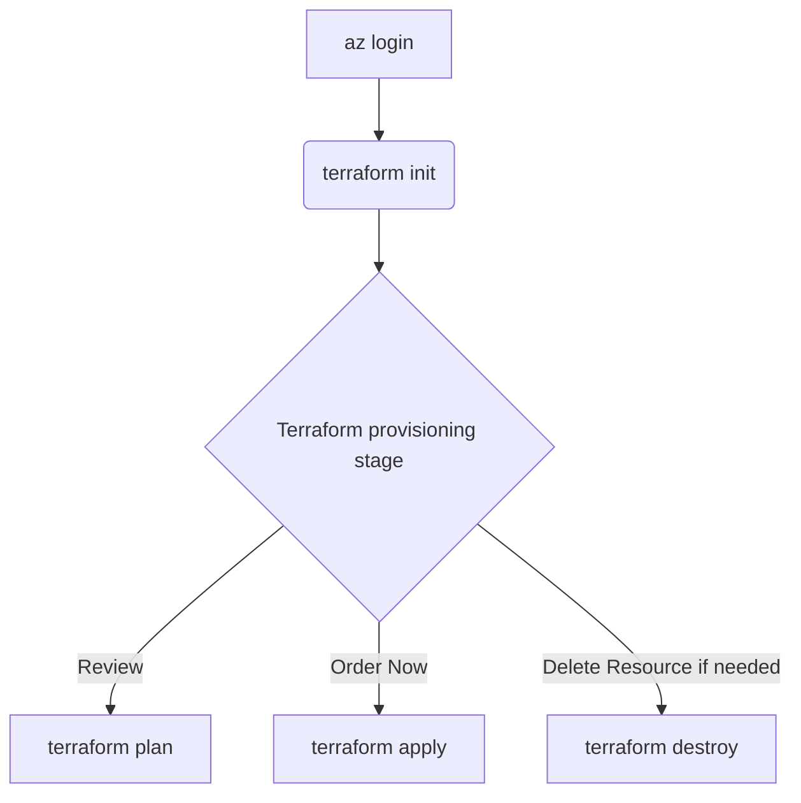

# Azure Logic Apps - Terraform Infrastructure

Costa Rica

[](https://github.com/)
[brown9804](https://github.com/brown9804)

Last updated: 2025-08-29

----------

> This approach focuses on `setting up the required infrastructure via Terraform`. It allows for source control of not only the solution code, connections, and setups `but also the infrastructure itself`. This repository specifically focuses on SAP integration with Azure Logic Apps, supporting both Stateful and Stateless workflow configurations.

<div align="center">
  
</div>

> The Terraform configuration supports both Stateful and Stateless Logic Apps, which have different characteristics:
> - `Stateful Logic Apps`: 
>   - Retain complete run history
>   - Support long-running workflows (up to 1 year)
>   - Maintain state between requests (can handle session cookies)
>   - Support built-in retry policies
>   - Use when session persistence or workflow history is needed  <br/>
> - `Stateless Logic Apps`: 
>   - No run history stored (lower cost)
>   - Faster execution
>   - Limited to 5-minute maximum execution time
>   - No state maintained between requests
>   - Use for simple integrations without session requirements

## Prerequisites

- An `Azure subscription is required`. All other resources, including instructions for creating a Resource Group, are provided in this workshop.
- `Contributor role assigned or any custom role that allows`: access to manage all resources, and the ability to deploy resources within subscription.
- Please ensure that:
  - [Terraform is installed on your local machine](https://developer.hashicorp.com/terraform/tutorials/azure-get-started/install-cli#install-terraform).
  - [Install the Azure CLI](https://learn.microsoft.com/en-us/cli/azure/install-azure-cli) to work with both Terraform and Azure commands.

## Overview 

Templates structure:

```
.
├── README.md
├────── main.tf
├────── variables.tf
├────── provider.tf
├────── terraform.tfvars
├────── outputs.tf
```

- main.tf `(Main Terraform configuration file)`: This file contains the core infrastructure code. It defines the resources you want to create, such as virtual machines, networks, and storage. It's the primary file where you describe your infrastructure in a declarative manner.
- variables.tf `(Variable definitions)`: This file is used to define variables that can be used throughout your Terraform configuration. By using variables, you can make your configuration more flexible and reusable. For example, you can define variables for resource names, sizes, and other parameters that might change between environments.
- provider.tf `(Provider configurations)`: Providers are plugins that Terraform uses to interact with cloud providers, SaaS providers, and other APIs. This file specifies which providers (e.g., AWS, Azure, Google Cloud) you are using and any necessary configuration for them, such as authentication details.
- terraform.tfvars `(Variable values)`: This file contains the actual values for the variables defined in `variables.tf`. By separating variable definitions and values, you can easily switch between different sets of values for different environments (e.g., development, staging, production) without changing the main configuration files.
- outputs.tf `(Output values)`: This file defines the output values that Terraform should return after applying the configuration. Outputs are useful for displaying information about the resources created, such as IP addresses, resource IDs, and other important details. They can also be used as inputs for other Terraform configurations or scripts.

## Finding `principal_id` Using Azure CLI

> The `principal_id` is typically the Object ID of a user, group, or service principal in Azure Entra ID (former AAD). You can find this ID in the Azure portal or by using the Azure CLI.

Get the Object ID of list of Users:

```sh
az ad user list --query "[].{Name:displayName, ObjectId:id, Email:userPrincipalName}" --output table
```


Here is an example value for `admin_principal_id` which is Object ID you retrieved.

```hcl
admin_principal_id = "12345678-1234-1234-1234-1234567890ab"
```

## How to execute it 



> [!IMPORTANT]
> Please modify `terraform.tfvars` with your information, then run the following flow. If you need more visual guidance, please check the video that illustrates the provisioning steps. 

1. **Login to Azure**: This command logs you into your Azure account. It opens a browser window where you can enter your Azure credentials. Once logged in, you can manage your Azure resources from the command line.

    > Go to the path where Terraform files are located:

    ```sh
    cd terraform-infrastructure
    ```
    
    ```sh
    az login
    ```

    

    

2. **Initialize Terraform**: Initializes the working directory containing the Terraform configuration files. It downloads the necessary provider plugins and sets up the backend for storing the state.

    ``` sh
    terraform init
    ```

   

3. **Terraform Provisioning Stage**: 

   - **Review**: Creates an execution plan, showing what actions Terraform will take to achieve the desired state defined in your configuration files. It uses the variable values specified in `terraform.tfvars`.

        ```sh
        terraform plan -var-file terraform.tfvars
        ```

        > At the end, you will see a message in green if everything was executed successfully: 

        

   - **Order Now**: Applies the changes required to reach the desired state of the configuration. It prompts for confirmation before making any changes. It also uses the variable values specified in `terraform.tfvars`.

        ```sh
        terraform apply -var-file terraform.tfvars
        ```

        > At the end, you will see a message in green if everything was executed successfully: 

        

   - **Remove**: Destroys the infrastructure managed by Terraform. It prompts for confirmation before deleting any resources. It also uses the variable values specified in `terraform.tfvars`.
    
        ```sh
        terraform destroy -var-file terraform.tfvars
        ```

        > At the end, you will see a message in green if everything was executed successfully: 

        

<!-- START BADGE -->
<div align="center">
  
  <p>Refresh Date: 2025-07-17</p>
</div>
<!-- END BADGE -->
